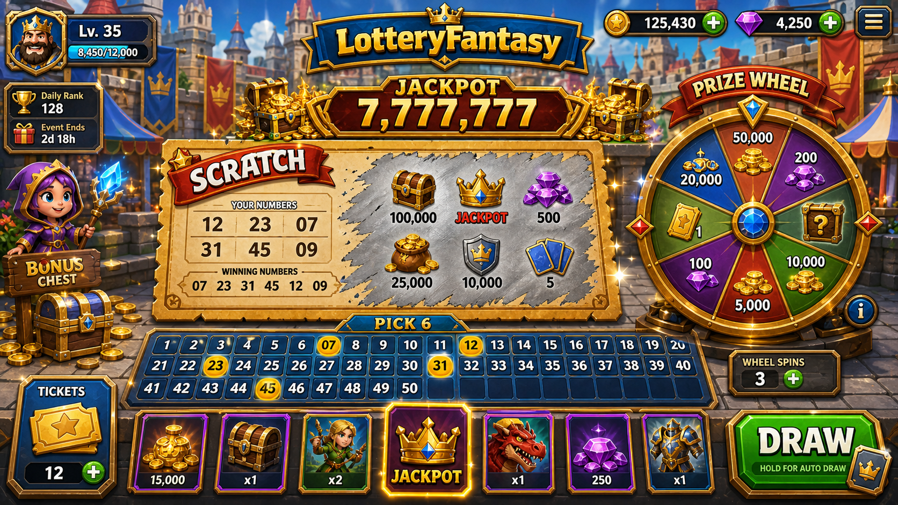

# LotteryFantasy GDD

- 작성일: 2026-09-11 KST
- 확인된 버전: v0.3.2 (근거: `LotteryFantasy_v0.3.2_portable.exe`, `release/LotteryFantasy_v0.3.2_portable.exe`, `docs/LotteryFantasy_기획서.md`의 "Release / Verification (2026-09-08)" 항목 — SHA-256 `DE37CA595F731544CAD14710FD35BA29AFCC16B977C074E17C8E026FD4049401`, 크기 112,522,900 bytes)
- Unity 에디터 버전: 2022.3.62f3 (근거: `LotteryFantasy/ProjectSettings/ProjectVersion.txt`)
- 문서 성격: 코드/데이터/테스트를 직접 열람해 재작성한 게임 디자인 문서(GDD). 추정 항목은 전부 "미확인"으로 표기.

## 플레이 예시 이미지

`docs/LotteryFantasy_gameplay_preview.png`는 `LotteryFantasy_기획서.md`의 "예시 이미지 기반 전장 연출" 항목에서 전장 비주얼 기준으로 직접 참조하는 파일이다. 같은 폴더에 `LotteryFantasy_01_플레이예시.png`, `LotteryFantasy_레퍼런스_플레이예시_구버전.png`도 존재하나(육안 미검증), 기획서 본문에서 명시적으로 참조하는 파일은 `LotteryFantasy_gameplay_preview.png`뿐이라 이를 대표 이미지로 채택했다. 기존 `LotteryFantasy_GDD.md`에는 이미지 링크가 없었으므로 보존할 기존 경로는 없다.

## 1. 기획 품질 6요소 요약

1. **핵심 재미가 무엇인가**: 슬롯 릴 결과(Fire/Iron/Life 3속성)를 멈추는 순간의 확률적 짜릿함이, 곧바로 카드 사용 판단(공격/방어/회복)으로 이어지는 "운을 전략으로 전환"하는 감각.
2. **왜 재미있는가**: `SpinOutcomeAdvisor.cs`가 릴 결과(트리플/페어/믹스)마다 즉시 "다음 행동 추천 문장"을 생성해 확률 이벤트와 전략 판단 사이의 인과관계를 명시적으로 끊지 않는다. `docs/persona_playtest_feedback.md`에 기록된 실제 피드백("운 좋은 결과를 전투 선택으로 바꾸는 순간의 짜릿함")이 이 인과관계가 실제로 체감된다는 근거다.
3. **목표 플레이어층**: `docs/LotteryFantasy_기획서.md`의 주 페르소나(박성우, 31세, Balatro 50시간+ 경험, "확률이 전략으로 이어지는 구조"를 선호, 슬롯/가챠 자체는 싫어함)를 1차 타깃으로 명시. 확률+전략 장르에 익숙한 PC 캐주얼 게이머.
4. **핵심 루프**: 슬롯 릴 자동 회전 → 행운 충전 소모로 릴 정지 → Fire/Iron/Life 에너지 획득 → 손패 카드 비용 지불(유닛/스킬/버프/건물) → 전투 결과 반영 → 다음 스핀. (`GameManager.cs`, `SlotMachineSystem.cs`, `ReelSystem.cs`, `ElementalEnergySystem.cs`, `HandSystem.cs`로 코드 검증)
5. **차별점**: 슬롯 결과가 카드 코스트 구성(`ReelSystem.BuildPool`이 덱의 fire/iron/life 코스트 총합으로 릴 확률 가중치를 만듦)과 직접 연결되어, 일반 슬롯/가챠와 달리 "내 덱 구성이 곧 내 릴 확률 구성"이 되는 자기참조 구조. 기획서는 이를 PokerStrike(족보 조합 코어 전략)와 차별화되는 "운을 전략으로 전환하는 캐주얼" 포지션으로 명시.
6. **리스크/도전 과제**: (a) 기획서 "평가 결정(2026-07-01)"에 기록된 플랫폼 미스매치(PC portable vs 모바일 캐주얼 감성), (b) PokerStrike와의 컨셉 근접에 따른 자기잠식 리스크, (c) EditMode 테스트 커버리지 부족 시 사일런트 버그 위험이 문서에 명시적으로 기록되어 있음(코드 근거: `Assets/Tests/EditMode/` 14개 테스트 파일 확인, 커버리지 정도는 미확인).

## 1-1. Problem Definition (문제 정의)

확률 기반 캐주얼 게임을 즐기는 플레이어는 슬롯/가챠가 "왜 이런 결과가 나왔는지, 다음에 뭘 해야 하는지" 알려주지 않아 순수 운에 좌우된다고 느끼기 쉽다 **[제안, 기존 기획서 문제정의 계승 — `docs/LotteryFantasy_기획서.md` 주 페르소나(박성우, 31세)의 "슬롯/가챠 자체는 싫어하지만 확률이 전략으로 이어지는 구조는 선호"라는 서술 근거]**. LotteryFantasy는 릴 결과를 즉시 "다음 행동 추천" 문장으로 번역하는 `SpinOutcomeAdvisor.cs`로 이 문제에 대응한다 **[사실, 코드 근거는 §1-2/§6에서 이미 확인]**. 다만 `기획서`의 "평가 결정(2026-07-01)"에 기록된 플랫폼 미스매치(PC portable vs 모바일 캐주얼 감성) 리스크는 이 문제 해결이 아직 타깃 플랫폼과 완전히 맞물리지 않았음을 시사한다 **[사실, 문서 근거]**.

## 2. 디자인 필러

- **인과율 있는 확률(Legible Luck)**: 릴 결과가 항상 다음 행동 추천으로 번역된다(`SpinOutcomeAdvisor`).
- **덱이 곧 확률판(Deck-as-Odds)**: 릴 풀은 고정 심볼표가 아니라 현재 덱의 코스트 분포에서 생성된다(`ReelSystem.BuildPool`).
- **짧은 판단 사이클**: 손패 4슬롯, 자동 보충(`HandSystem` capacity 4, `GameManager.Update`에서 빈 슬롯 즉시 보충)으로 대기 시간을 최소화.
- **대칭 대결 구조**: 플레이어/AI 모두 동일한 마을 체력(`BattleManager` villageHp 기본 1000)과 유사한 충전 로직을 공유(비대칭 수치는 `docs/LotteryFantasy_기획서.md`의 "룰렛 밸런스" 항목 기준, 코드상 AI 파라미터 값 자체는 이번 조사에서 미확인).

## 3. 구성요소

| 역할 | 선택 | 입력 → 판정 → 피드백 | 상태 |
|---|---|---|---|
| 슬롯 릴(3개) | 정지 타이밍 선택 | 행운 충전 1 소모(`SlotMachine.TrySpin`) → 릴 심볼 확정(`GameManager.TryStopReel`/`TryStopAllReels`) → 심볼별 UI 표시 | 구현됨 |
| 행운 충전(SlotMachineSystem) | 없음(자동 충전, 소모만 선택) | 시간 경과(`Tick`) → 충전량 증가 → HUD 게이지 반영 | 구현됨 |
| 속성 에너지(ElementalEnergySystem) | 없음(릴 결과 자동 반영) | `CommitSpin` 호출 → `ReelSystem.CalcEnergy` 결과 가산(최대 10/속성) → 에너지 HUD 갱신 | 구현됨 |
| 손패 카드(HandSystem, 4슬롯) | 사용할 카드 선택 | 카드 클릭/드래그 → 코스트 판정(`ElementalEnergySystem.CanAfford`/`TryConsume`) → 유닛/스킬/버프/건물 발동 또는 부족 피드백 | 구현됨 |
| 덱(FixedDeckConfig, 12장 선언) | 없음(고정 덱, 순환 배분) | 빈 손패 슬롯 발생 → `DeckSystem.DealNext` 순환 배분 → 손패 자동 보충 | 구현됨(12장 크기는 주석 권장치이며 코드 강제 검증 없음, 실제 12장 채움 여부는 미확인) |
| 전투(BattleManager) | 없음(자동 판정) | 시간/체력 변화 → `GetResult` 판정(승/패/무/진행중) → `GameEvents.BattleEnded` | 구현됨 |
| 몬스터(MonsterConfig) | 없음(AI 자동) | 스폰 → 이동/공격 → HP 소진 시 처치 | 구현됨(수치 데이터 자산 자체는 미확인, 필드 스키마만 코드로 확인) |
| 건물(BuildingData: 전투/에너지생산/유닛생산 3종) | 배치 위치 선택 | 카드 코스트 지불 → 배치 → 지속 효과(공격/에너지 생산/유닛 생산) | 구현됨(스키마 확인, 배치 UI 세부 흐름은 미확인) |

## 4. 콘텐츠 제공 방식

- **해금 조건**: 코드/데이터에서 별도 해금 게이트(레벨, 재화, 조건부 언락 로직)가 발견되지 않음. **미확인** — 전투 시작 시 고정 덱(`FixedDeckConfig`)이 그대로 사용되는 구조만 확인됨.
- **순서**: 슬롯 스핀은 전투 시작과 동시에 자동 개시(`GameManager.StartBattle` → `BeginNewSpin`)되고, 이후 매 커밋마다 즉시 재시작(`CommitSpin` 끝에서 `BeginNewSpin` 재호출)되어 대기 없는 순환 구조. 손패 보충 순서는 `DeckSystem.DealNext`의 인덱스 순환(`_dealIndex % _deck.Length`)으로 결정적(deterministic)임 — 셔플 로직은 코드에서 발견되지 않음.
- **보상**: 전투 승리/패배/무승부는 `BattleResult` 열거형(코드 확인)으로 판정되나, 승리 보상(재화, 카드 언락 등) 지급 로직은 이번 조사 범위에서 발견되지 않음. **미확인**.
- **변형(변주)**: 게임 모드 2종(`GameMode.Battle`, `GameMode.Survival`), 카드 타입 4종(`CardType.Unit/Skill/Buff/Building`), 카드 등급 2종(`CardTier.Normal/Enhanced`), 스킬 종류 2종(`SkillType.LightningArrow/PortalBomb`), 건물 종류 3종(`BuildingType.BattleTower/ProductionEnergy/ProductionUnit`), 속성 3종(`ElementType.Fire/Iron/Life`) — 모두 enum/구조체로 코드 확인.
- **공급량(수량 상한)**: 손패 슬롯 4개(`HandSystem` capacity 4), 속성 에너지 상한 10(`ElementalEnergySystem.Max`), 행운 충전 상한 6(`SlotMachineSystem.DefaultMaxCharges`), 고정 덱 배열 크기 12(`FixedDeckConfig.cards` 선언 크기, 강제 검증 없음).

## 5. Session (세션): 30초 / 5분 / 30분 / 장기 — 세션 관점별 서술

- **30초**: 전투 시작 즉시 첫 스핀이 자동 준비된다(`BeginNewSpin`). 초기 충전 1회(`SlotMachineSystem(chargeInterval: 10f, initialCharges: 1)`)로 30초 내 최소 1회 릴 정지와 카드 판단이 가능한 구조. 정확한 온보딩 화면 순서(튜토리얼 여부)는 미확인.
- **5분**: 충전 간격 10초, 최대 6충전 한도 내에서 여러 번 스핀-소모 사이클이 반복되며, 손패 4슬롯이 자동 보충되어 지속적으로 카드 판단이 발생. 전투 종료 조건(마을 HP 0 또는 제한시간 180초 경과 시 HP 비교)이 5분 내에 걸릴 가능성이 높음(기본 `battleDuration` 180초, `GameManager` 필드 기본값 기준).
- **30분**: 전투 모드 기준 1회전은 180초(3분) 내외로 종료되므로, 30분 세션은 다회차 전투 반복으로 구성될 것으로 추정됨. 생존 모드는 `isSurvivalMode`일 때 `battleDuration`을 99999초로 사실상 무제한 처리하여 장기 웨이브 버티기 형태(코드 확인). 다만 전투 간 재화/성장 연계는 미확인.
- **장기(리텐션)**: 일일 로그인 보상, 시즌 콘텐츠, 장기 성장 커브(레벨/재화 곡선) 등은 코드/데이터에서 발견되지 않음. **미확인**. `docs/LotteryFantasy_기획서.md`의 "평가 결정" 섹션에 WebGL 무료 배포 → Steam 유료 전환 검토라는 제품 로드맵 수준의 장기 계획만 문서로 확인됨(제안 단계).

## 6. 재미 체인(Fun Chain)

슬롯 정지 입력(플레이어 행동) → 릴 심볼 확정(확률 이벤트, `ReelSystem.Spin`) → 트리플/페어/믹스 판정(`DeckSystem.EvaluateReels` 또는 `SpinOutcomeAdvisor`의 트리플/페어 판정) → 속성 에너지 획득량 결정(`ReelSystem.CalcEnergy`: 단일 1, 페어 2+1보너스=3, 트리플 3+3보너스=6, 테스트 `ReelSystemTests.cs`로 수치 확인) → 즉시 "다음 행동 추천" 텍스트 노출(`SpinOutcomeAdvisor.Describe`) → 손패 카드 사용 가능/불가 여부 재평가(`ElementalEnergySystem.CanAfford`/`MissingCost`) → 카드 사용 시 전투 상태 변화(유닛 소환/스킬 피해/버프/건물 배치) → 전투 HP 변화가 다음 스핀에 대한 위기감(공격 급함/방어 급함)을 만들어 다시 슬롯 정지 판단으로 순환.

## 7. 실제 플레이 예시 2개 (코드/데이터 기반)

**예시 1 — Fire 트리플 잭팟**
릴 3개가 모두 Fire로 멈춘 경우, `DeckSystem.EvaluateReels`는 `SlotResult.Triple`을 반환하고 `ReelSystem.CalcEnergy`는 Fire 에너지 3(기본)+3(트리플 보너스)=6을 반환한다(`ReelSystemTests.CalcEnergy_ThreeSame_GivesBigBonus`로 검증됨). 동시에 `SpinOutcomeAdvisor.Describe`는 `isTriple=true` 분기를 타 "JACKPOT - FIRE x6" 헤드라인과 "공격 선택: 다음 웨이브에서 몰려드는 적에게 화염 스킬을 먼저 쓰세요"라는 `NextDecisionFor(Fire)` 문구를 생성한다. 플레이어는 Fire 코스트 카드(예: 공격형 유닛/스킬)를 즉시 사용할 자원을 확보한다.

**예시 2 — Iron/Iron/Life 페어(믹스 아님, 페어)**
릴이 Iron, Iron, Life로 멈추면 `ReelSystem.CalcEnergy`는 Iron 2(기본)+1(페어 보너스)=3, Life 1을 반환한다(`ReelSystemTests.CalcEnergy_TwoSame_GivesBonus`와 동일한 계산 로직). `SpinOutcomeAdvisor.HasPair`가 Iron 페어를 감지해 "IRON PAIR - IRON x3 / LIFE x1" 헤드라인과 "방어 선택: 마을 체력이 흔들리면 방어 카드와 전열 보강을 우선하세요"라는 조언을 출력한다. 플레이어는 이를 근거로 방어형 카드(예: BattleTower 건물 또는 방어 유닛)를 우선 사용하도록 유도된다.

## 8. 피로도/실패 완화 방안

- **초기 충전 보장**: 행운 충전이 0에서 시작하지 않고 1로 시작(`SlotMachineSystem(initialCharges: 1)`)해 전투 시작 직후 완전한 무력 대기 상태를 피함(코드 확인).
- **손패 즉시 보충**: 빈 슬롯이 생기면 `Update` 루프에서 매 프레임 즉시 덱에서 카드를 채워 손패가 비어 있는 시간을 최소화(`GameManager.Update`의 `while (!Hand.IsFull)` 루프로 확인).
- **부족 자원 명시 피드백**: `ElementalEnergySystem.MissingCost`로 부족한 속성만 정확히 계산해 카드 하단에 표시하는 로직이 존재(`docs/LotteryFantasy_기획서.md` "부족 에너지 피드백 강화" 항목, EditMode 테스트 3개 추가로 문서에 명시). 이는 "왜 카드를 못 쓰는지" 즉시 이해시켜 좌절감을 줄이는 설계.
- **믹스(꽝) 결과도 무의미하지 않게 처리**: 트리플/페어가 아닌 믹스 결과도 `SpinOutcomeAdvisor`가 "위험 관리: 부족한 속성을 보완하세요" 식의 대응 조언을 제공해, 완전한 "꽝" 개념 없이 항상 다음 행동이 있다는 점을 전달(코드 확인).
- **패배 후 재도전 동선**(재화/재시작 UX 세부)은 미확인.

## 9. 경제/성장/밸런스

- **자원 상한**: 속성 에너지 상한 10(`ElementalEnergySystem.Max`), 행운 충전 상한 6(`SlotMachineSystem.DefaultMaxCharges`) — 둘 다 코드 상수로 확인됨.
- **충전 속도**: 플레이어 충전 간격 10초(`GameManager.Awake`에서 `new SlotMachineSystem(chargeInterval: 10f, initialCharges: 1)`로 확정). `docs/LotteryFantasy_기획서.md`의 "룰렛 밸런스" 업데이트(2026-05-27)에서 최대 충전량을 10→6으로 낮추고 간격을 6초→10초로 늘렸다는 서술과 현재 코드 상수(`DefaultMaxCharges=6`, `chargeInterval: 10f`)가 일치함 — 문서와 코드가 상호 검증됨.
- **AI 측 파라미터**(AI 시작 충전, AI 충전 간격, AI 슬롯 사용 간격 등 구체 수치)는 `AIOpponent.cs` 내부 구현으로 추정되나 이번 조사에서 파일 본문을 상세 대조하지 않아 **미확인**으로 남긴다. 문서(`LotteryFantasy_기획서.md`)에는 AI 시작 충전 1, AI 충전 6초, AI 사용 간격 7초라는 서술이 있으나 코드 대조는 하지 않았다.
- **전투 밸런스**: 마을 HP 기본 1000, 전투 제한시간 기본 180초(3분), 시간 종료 시 HP 우위 판정, HP 동률 시 무승부(`BattleManager.GetResult` 코드 확인). 생존 모드는 제한시간을 사실상 무제한(99999초)으로 전환.
- **성장 곡선(레벨업, 카드 강화, 재화 시스템)**: 코드/데이터에서 발견되지 않음. **미확인**.

## 10. 온보딩 / UI-HUD 5가지 상태 / 접근성 / 오디오-비주얼

**UI-HUD 5가지 상태** (코드로 확인된 화면/상태 요소 기준)
1. 대기/충전 상태 — 행운 게이지가 차오르는 상태(`EnergyHUD`/`SlotMachineUI`, `ChargeRatio` 반영, 문서 "행운 게이지 릴 근처 재배치" 항목으로 위치 확인).
2. 릴 회전/정지 상태 — `SlotMachineUI`가 릴 스트립 회전과 STOP/AUTO 버튼 상태색을 관리(문서 "릴 스트립 회전 연출" 항목).
3. 손패/카드 판단 상태 — `HandUI`, `CardDragHandler`가 카드 사용 가능/부족 상태를 구분 표시(문서 "카드 비용 아이콘 표시", "부족 에너지 피드백 강화" 항목).
4. 전투 진행 HUD 상태 — `ArenaHUD`, `HpBar`가 플레이어/적 HP와 타이머를 표시(코드 파일 확인, 좌우 대칭 배치는 문서 "상단 HUD 균형 재배치" 항목).
5. 결과/덱 열람 상태 — `DeckViewerUI`와 결과 모달(문서 "결과/덱 화면" 항목, 어두운 오버레이 + 금색/청색 accent).

**온보딩**: 별도 튜토리얼 스크립트/씬은 이번 조사에서 발견되지 않음. **미확인**.

**접근성**: 색각 보조 표기, 스크린리더, 고대비 모드, 폰트 크기 조절 등 접근성 전용 구현은 코드에서 발견되지 않음. **미확인**. TextMesh Pro 패키지가 포함되어 있어 폰트 크기/스타일 조정 자체는 기술적으로 가능하나 실제 접근성 옵션 UI는 미확인.

**오디오-비주얼**: `docs/LotteryFantasy_기획서.md`의 "오디오 시스템(2026-09-08 업데이트)" 항목이 BGM(Kenney Music Loops CC0 OGG 루프 1곡), SFX(자체 제작 CC0 WAV 6종: 입력/액션/위험/전환/성공/실패), 볼륨 분리 저장, 브라우저 제스처 이후 재생 정책, 권장 믹스(BGM 0.28 / SFX 0.70)를 명시. 코드 측 `RuntimeAudioDirectorTests.cs` 테스트 파일 존재로 오디오 시스템이 테스트 대상임을 확인했으나 오디오 재생 클래스 본문은 이번 조사에서 상세 대조하지 않음.

## 11. 구현됨 / 계획됨 / 제안

**구현됨** (코드/테스트로 직접 확인)
- 슬롯 릴 회전·정지·에너지 환산 전체 파이프라인(`ReelSystem`, `SlotMachineSystem`, `GameManager`)
- 속성 에너지 누적/소비/부족분 계산(`ElementalEnergySystem`)
- 고정 손패 4슬롯과 자동 보충(`HandSystem`, `DeckSystem`)
- 전투 승패/무승부/생존 모드 판정(`BattleManager`, `GameMode`)
- 릴 결과별 행동 추천 텍스트(`SpinOutcomeAdvisor`)
- 카드 4타입/2등급, 스킬 2종, 건물 3종 데이터 스키마(`CardType`, `CardTier`, `SkillType`, `BuildingType`)
- 14개 EditMode 테스트 파일 존재(`Assets/Tests/EditMode/*.cs`, 커버리지 범위는 미확인)
- 오디오 시스템(BGM 1곡 + SFX 6종, 문서 기준), Toony RTS 비주얼 리소스 적용(문서 기준)

**계획됨** (문서에 다음 작업으로 명시되어 있으나 코드 반영 여부가 불확실하거나 부분 반영)
- 릴 결과별 "라운드 전개선"(FIRE→공격/IRON→방어/LIFE→회복 추천 문구)의 확장 — `docs/next_improvement_instruction.md`에 `SpinOutcomeAdvisor.cs` 확장과 `SlotMachineUI.cs` 텍스트 추가가 계획되어 있으나, "Unity batchmode 라이선스 부재로 검증 차단"이 기록되어 있어 최종 반영 여부는 미확인.
- WebGL 빌드 후 itch.io 무료 배포 → Steam 유료 전환 검토(`LotteryFantasy_기획서.md` "평가 결정" 항목).
- Triple Jackpot 시각/사운드 보강(같은 항목).

**제안** (본 GDD 작성 과정에서 코드/문서 격차를 근거로 새로 제시하는 항목, 기존 문서에 없음)
- 고정 덱 12장 크기에 대한 실제 검증 로직 추가(현재는 tooltip 권장치일 뿐 런타임 assert 없음) — 덱 크기가 12가 아닐 경우 조용히 오동작할 위험을 줄이기 위함.
- 전투 승리/패배 시 재화·카드 해금 등 보상 지급 로직의 명문화 — 현재 `BattleResult` 판정 이후 보상 지급 코드가 발견되지 않아, 장기 리텐션 루프가 비어 있음.
- 접근성 옵션(색각 보조 아이콘, 폰트 크기 조절 UI)의 최소 버전 추가 — 현재 완전 미구현 상태이므로 별도 릴리스 이전에 최소 대응 필요.

## 12. 성공 KPI

- **첫 스핀 도달 시간**: 전투 시작 후 첫 릴 정지까지 걸리는 시간(목표: 초기 충전 1회로 즉시 가능하므로 30초 이내). 측정 방법은 별도 로깅 코드가 확인되지 않아 **미확인**(제안: `GameEvents`에 타임스탬프 로깅 추가).
- **테스트 회귀 안정성**: `Assets/Tests/EditMode/` 14개 파일의 전체 통과 유지. 과거 실행 근거는 `docs/LotteryFantasy_기획서.md`의 "TestResults-EnergyFeedback.xml 기준 ElementalEnergySystemTests 9개 통과, 실패 0개" 기록으로 확인되나, 현재 전체 스위트 통과 여부는 이번 조사에서 재실행하지 않아 미확인.
- **빌드 안정성**: portable exe SHA-256 일치 및 격리 폴더 실행 검증(문서 "Release / Verification (2026-09-08)" 항목 기준 달성 확인). 향후 KPI로 "빌드 재시도 로그 0건"을 제안.
- **세션당 전투 완료 수**(리텐션 지표): 코드/로그에서 측정 인프라가 발견되지 않아 미확인. 제안 KPI로 남김.

## 13. 다음 우선순위

1. `docs/next_improvement_instruction.md`에 명시된 `SpinOutcomeAdvisor`/`SlotMachineUI` 라운드 전개선 확장을 Unity 라이선스 확보 후 실제로 검증하고 반영 여부를 확정한다.
2. 전투 결과(승/패/무) 이후 보상 지급 로직 유무를 명확히 조사하고, 없다면 최소 보상 루프를 설계한다(현재 GDD 기준 미확인 항목 1순위).
3. 고정 덱 크기(12장) 및 AI 파라미터(충전 간격/시작 충전량)에 대한 런타임 검증 코드를 추가해 문서-코드 정합성을 보장한다.
4. 접근성 최소 대응(색각 보조 표기 등)을 다음 UI 개편 범위에 포함한다.
5. 전체 EditMode 테스트 스위트를 재실행해 현재 통과 상태를 갱신하고, 세션당 전투 완료 수 등 리텐션 KPI 로깅을 추가한다.

## 근거 노트 (Evidence Note)

- 프로젝트 규칙/구조: `C:\Development\14_LT\AGENTS.md`, `C:\Development\14_LT\CLAUDE.md`, `C:\Development\14_LT\LotteryFantasy\CLAUDE.md`, `C:\Development\14_LT\docs\structure_authority.md`
- 버전: `C:\Development\14_LT\LotteryFantasy_v0.3.2_portable.exe`, `C:\Development\14_LT\release\LotteryFantasy_v0.3.2_portable.exe`, `C:\Development\14_LT\LotteryFantasy\ProjectSettings\ProjectVersion.txt`(Unity 2022.3.62f3), `docs/LotteryFantasy_기획서.md`의 Release/Verification 섹션
- 기존 문서: `C:\Development\14_LT\docs\LotteryFantasy_GDD.md`(재작성 전 버전, 전량을 [PROPOSAL]/[FACT] 태그로 자기 표기한 추정 문서였음을 확인 후 폐기·대체), `C:\Development\14_LT\docs\LotteryFantasy_기획서.md`, `C:\Development\14_LT\docs\persona_playtest_feedback.md`, `C:\Development\14_LT\docs\next_improvement_instruction.md`, `C:\Development\14_LT\docs\LotteryFantasy_이미지_UI_리소스_목록.md`
- 핵심 코드: `LotteryFantasy/Assets/Scripts/Config/ElementType.cs`, `CardType.cs`, `CardTier.cs`, `GameMode.cs`, `FixedDeckConfig.cs`, `CardData.cs`, `UnitStats.cs`, `SkillEffect.cs`, `BuffEffect.cs`, `BuildingData.cs`, `MonsterConfig.cs`; `LotteryFantasy/Assets/Scripts/Systems/SlotMachineSystem.cs`, `ReelSystem.cs`, `ElementalEnergySystem.cs`, `DeckSystem.cs`, `HandSystem.cs`, `BattleManager.cs`, `SpinOutcomeAdvisor.cs`; `LotteryFantasy/Assets/Scripts/Core/GameManager.cs`
- 테스트: `LotteryFantasy/Assets/Tests/EditMode/ReelSystemTests.cs`(에너지 환산 수치 검증), 그 외 13개 EditMode 테스트 파일 목록만 확인(전체 본문 대조는 하지 않음)
- 이미지: `docs/LotteryFantasy_gameplay_preview.png` 외 `docs/LotteryFantasy_01_플레이예시.png`, `docs/LotteryFantasy_레퍼런스_플레이예시_구버전.png`, `docs/app_icon.png` 존재 확인(파일 목록 기준, 픽셀 내용 육안 검수는 하지 않음)
- 이번 조사에서 열람하지 않은 항목: `AIOpponent.cs` 본문, `UnitController.cs`/`MonsterController.cs`/`BuildingController.cs` 본문, `RuntimeAudioDirectorTests.cs` 및 관련 오디오 클래스 본문, 실제 `CardData`/`MonsterConfig` ScriptableObject 에셋 인스턴스(검색 결과 `.asset` 파일 중 카드/몬스터 데이터 인스턴스가 발견되지 않음 — 씬 내장이거나 별도 경로일 가능성, 미확인).
