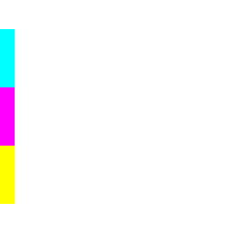
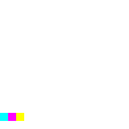

# Lottery Fantasy 기획서

> 최신 업데이트: 2026-05-28, 생성형 이미지/UI 리소스 시트 추가

## 게임 개요

Lottery Fantasy는 3릴 슬롯 결과로 속성 에너지를 얻고, 그 에너지로 카드형 유닛/스킬/건물을 배치해 마을을 방어하거나 상대 기지를 파괴하는 Unity 2D 전략 게임이다.

## 핵심 루프

1. 슬롯 릴이 자동 회전한다.
2. 행운 충전이 쌓이면 STOP으로 릴 3개를 정지한다.
3. Fire/Iron/Life 결과에 따라 속성 에너지를 획득한다.
4. 손패의 카드 비용을 지불하고 유닛, 스킬, 건물을 사용한다.
5. 유닛과 건물이 포털/기지/몬스터를 상대하며 승패를 결정한다.

## 게임 모드

| 모드 | 설명 |
|---|---|
| 전투 모드 | 3분 동안 AI 기지를 먼저 파괴하거나 제한 시간 후 HP 우위로 승리한다. |
| 생존 모드 | 계속 강화되는 웨이브를 상대로 오래 버틴다. |

## UI 비주얼 방향

2026-05-15 업데이트에서 런타임 생성 UI의 구조는 유지하고, 공통 스타일 유틸을 통해 화면 완성도를 높였다.

| 영역 | 변경 방향 |
|---|---|
| 상단 HUD | 짙은 전투 정보 바, 명확한 HP 색상, 덱 버튼 강조색 적용 |
| 하단 패널 | 카드 영역과 슬롯 영역을 더 또렷하게 분리하고 파란 계열 테두리로 통일 |
| 카드 | 타입/사용 가능/선택/부족 상태별 배경색 통일, 금색 상단 라인과 어두운 하단 라인 추가 |
| 슬롯머신 | 릴 박스 크기 확대, 속성별 상단 accent, STOP/AUTO 버튼 상태색 강화 |
| 결과/덱 화면 | 어두운 오버레이와 금색/청색 accent로 모달 느낌 강화 |

## 오브젝트 및 캐릭터 에셋 방향

2026-05-18 업데이트에서는 새 외부 다운로드보다 프로젝트에 이미 포함된 무료/샘플 에셋을 우선 사용한다. 게임플레이 루트 오브젝트의 `Rigidbody2D`, `Collider2D`, `HpBar`, 컨트롤러 구조는 유지하고, 로우폴리 모델과 자연 소품은 자식 장식 오브젝트로 붙인다.

| 영역 | 사용 에셋 |
|---|---|
| 유닛 | `Polytope Studio` 로우폴리 캐릭터/장비 프리팹 |
| 몬스터 | `Polytope Studio` 캐릭터 파츠를 몬스터/엘리트 구분용 장식으로 사용 |
| 기지 | `SimpleNaturePack` 나무/자연 프리팹으로 마을 실루엣 강화 |
| 포털 | `Polytope Studio` 목재/소품 프리팹을 포털 relic 장식으로 사용 |
| 전장 | `SimpleNaturePack` 나무, 바위, 덤불, 꽃과 `Polytope Studio` 울타리로 주변부 장식 |

## 예시 이미지 기반 전장 연출

2026-05-22 업데이트에서는 `docs/LotteryFantasy_gameplay_preview.png`의 밝은 캐주얼 판타지 방향을 기준으로 런타임 전장 장식을 보강했다. UI와 게임플레이 구조는 유지하고, 게임 시작 시 `GameVisualKit.AddArenaBackdrop`이 전장 바닥, 중앙 흙길, 하단 석재 테라스, 플레이어/적 진영 실루엣, 깃발과 금색 문장을 생성한다.

| 영역 | 변경 방향 |
|---|---|
| 전장 배경 | 밝은 녹색 전장, 먼 언덕, 중앙 흙길을 추가해 예시 이미지처럼 공간 깊이를 만든다. |
| 플레이어/적 기지 | 파랑/빨강 배너와 금색 문장을 배치해 진영 구분을 강화한다. |
| 생존 모드 | 적 기지 대신 보라색 포털 받침대 실루엣을 배치해 모드 목적을 명확히 한다. |
| 구현 방식 | 외부 다운로드 없이 코드 생성 SpriteRenderer와 기존 포함 에셋만 사용한다. |

## 룰렛 밸런스 및 유닛 식별성

2026-05-27 업데이트에서는 룰렛을 덜 자주 돌리도록 행운 충전 밸런스를 낮추고, 예시 이미지처럼 유닛 역할이 한눈에 갈라지도록 런타임 장식을 강화했다.

| 영역 | 변경 방향 |
|---|---|
| 룰렛 충전 | 기본 최대 충전량을 10개에서 6개로 낮춘다. |
| 시작 충전 | 플레이어와 AI 모두 시작 충전을 3개에서 1개로 줄인다. |
| 충전 간격 | 플레이어 자동 충전은 6초에서 10초, AI 충전은 3초에서 6초로 늘린다. |
| AI 사용 빈도 | AI 슬롯 사용 간격을 4초에서 7초로 늘려 초반 압박을 완화한다. |
| 유닛 식별성 | 검사/기사/궁수/마법/힐러/거인 계열에 서로 다른 accent 색, 스케일, 무기 위치를 적용한다. |

## 생성형 이미지/UI 리소스

2026-05-28 업데이트에서는 예시 이미지의 밝은 캐주얼 판타지 톤을 기준으로 카드/유닛 아이콘, UI 아틀라스, 전장 오브젝트 시트를 생성했다. 실제 사용 목록과 슬라이스 가이드는 `docs/LotteryFantasy_이미지_UI_리소스_목록.md`에 정리한다.

| 파일 | 용도 |
|---|---|
| `LotteryFantasy/Assets/Resources/GeneratedArt/lotteryfantasy-card-unit-icons-sheet.png` | 카드 초상화와 유닛 아이콘 후보 |
| `LotteryFantasy/Assets/Resources/GeneratedArt/lotteryfantasy-ui-atlas-sheet.png` | HUD, 슬롯머신, 버튼, 속성 심볼, 배지 후보 |
| `LotteryFantasy/Assets/Resources/GeneratedArt/lotteryfantasy-battlefield-props-sheet.png` | 기지, 포털, 전장 장식 후보 |
| `LotteryFantasy/Assets/Resources/GeneratedArt/lotteryfantasy-buttons-sheet.png` | STOP, Draw, 확인, 보상, 비활성, 탭, 토글 버튼 후보 |
| `LotteryFantasy/Assets/Resources/GeneratedArt/lotteryfantasy-frames-sheet.png` | HUD, 슬롯머신, 카드, 모달, 툴팁 프레임 후보 |

## 진영 식별 표식 강화

2026-06-02 업데이트에서 전투 중 아군 유닛, 적 유닛, 중립 몬스터가 더 빨리 구분되도록 `GameVisualKit`의 런타임 장식을 강화했다. 직업별 accent 색은 유지하고, 진영 판독용 바닥 표식과 측면 배지를 별도 레이어로 추가했다.

| 영역 | 적용 내용 |
|---|---|
| 아군 유닛 | 파란 바닥 글로우, 파란 지면 스트라이프, 우측 진영 배지로 표시 |
| 적 유닛 | 빨간 바닥 글로우, 빨간 지면 스트라이프, 좌측 진영 배지로 표시 |
| 중립 몬스터 | 공격 방향과 무관하게 주황/보라 `NeutralMonsterMarker`를 사용해 유닛 진영과 분리 |
| 엘리트 몬스터 | 중립 몬스터 표식 폭과 경고 장식을 키워 일반 몬스터보다 위협적으로 표시 |

## Toony RTS 리소스 적용

2026-06-08 업데이트에서 새로 추가된 `ToonyTinyPeople/TT_RTS` 에셋을 런타임 리소스로 선별 적용했다. 빌드에서도 `Resources.Load`가 가능하도록 주요 유닛, 배너, 공성기 프리팹을 `Assets/Resources/Asset/ToonyTinyPeople/TT_RTS/TT_RTS_Standard/prefabs` 아래에 복사하고, `GameVisualKit`의 시각 매핑을 Toony RTS 우선으로 변경했다.

| 영역 | 적용 내용 |
|---|---|
| 아군/적 유닛 | Swordsman, Archer, Mage, Priest, Paladin, Heavy Infantry 등 역할별 Toony 캐릭터 프리팹 사용 |
| 중립 몬스터 | 일반 몬스터는 `TT_HeavySwordman`, 엘리트 몬스터는 `TT_King`으로 교체해 유닛보다 강한 실루엣으로 표시 |
| 건물/타워 | Tower 계열은 Ballista, Magic/Fire 계열은 Catapult, Barracks는 Ram 프리팹으로 표시 |
| 기지/포탈 | 플레이어/적/중립 거점에 파랑/빨강/보라 Toony 배너를 추가 |
| 전장 소품 | 전장 후방과 측면에 Ballista, Catapult, Yellow/Orange Banner 소품을 배치해 RTS 전장 분위기를 강화 |

## 빌드 및 배포

- Unity 프로젝트 경로: `C:/Development/14_LT/LotteryFantasy`
- Windows 빌드 출력: `C:/Development/14_LT/release/LotteryFantasy.exe`
- 포터블 실행파일 배치: `C:/Development/14_LT/LotteryFantasy_v{버전}_portable.exe`
## 생성 리소스 런타임 적용

2026-05-29 업데이트에서 생성된 버튼, 프레임, 카드 아이콘, 전장 오브젝트 시트를 `Resources/GeneratedArt`에서 런타임 로드해 실제 UI와 전장에 적용했다. `UIArtKit`이 시트별 스프라이트 좌표와 9-slice border를 관리하며, 시작 메뉴/덱 보기/결과 모달/에너지 패널/룰렛 패널/손패 카드 프레임에 버튼 및 프레임 리소스를 사용한다.

| 영역 | 적용 내용 |
|---|---|
| 카드 | 생성 카드 아이콘 시트를 `CardData.icon`과 `HandUI` fallback 아이콘에 연결하고, 손패 슬롯에 브론즈/실버/골드/퍼플 카드 프레임을 적용 |
| 룰렛/버튼 | STOP, AUTO, 덱 보기, 시작 메뉴, 재시도 버튼에 생성 버튼 시트와 프레임 시트 적용 |
| HUD/패널 | HP 프레임, 타이머 배너, 에너지 패널, 덱 보기 모달, 결과 모달에 생성 프레임 적용 |
| 전장 | 플레이어/적 성, 생존 포탈, 중앙 길 패치, 나무/울타리/바위/횃불/성벽 장식을 생성 전장 오브젝트 시트에서 SpriteRenderer로 추가 |
## Asset Store 대체 로우폴리 바람 연출

2026-05-29 업데이트에서 `Low Poly Wind` 패키지를 직접 다운로드하지 못하는 상황을 대비해 프로젝트 내 런타임 바람 연출을 추가했다. `LowPolyWindAnimator`는 Tree/Grass/Banner/Torch/Portal/AmbientProp 프로필별로 위치, 회전, 스케일을 미세하게 흔들어 로우폴리 맵의 정적인 느낌을 줄인다.

| 영역 | 적용 내용 |
|---|---|
| 전장 풀 | 포함된 `PT_Grass_02` 프리팹을 전장 하단에 추가하고 Grass 프로필의 빠른 흔들림 적용 |
| 나무/덤불/울타리 | 기존 자연 프리팹과 생성 오브젝트에 Tree/Banner/Grass 프로필을 연결 |
| 성/포탈 장식 | 생성 성, 포탈, 건물 장식에 Banner/Portal 프로필을 적용해 깃발과 마법 장식이 은근히 움직이도록 구성 |
| 검증 | `LowPolyWindAnimatorTests`와 `GameVisualKitTests`에 프로필/전장 연결 확인 테스트 추가 |
## 카드/마법 구분 및 릴 이미지 적용

2026-05-29 업데이트에서 마법 카드와 유닛 카드의 시각 구분을 강화하고, 릴 UI에 텍스트 대신 생성된 Fire/Iron/Life 이미지 심볼을 적용했다. 릴은 회전 중 이미지가 빠르게 교체되고 회전/펄스 애니메이션을 보여주며, 착지 시 최종 속성 이미지가 바운스한다.

| 영역 | 적용 내용 |
|---|---|
| 마법 카드 | `MAGIC` 라벨, 보라색 프레임, 속성 심볼 아이콘으로 유닛 카드와 분리 |
| 유닛/건물 카드 | `UNIT`/`BUILD` 라벨과 타입별 프레임을 적용해 카드 역할 구분 강화 |
| 릴 UI | Fire/Iron/Life 이미지 아이콘을 릴 내부에 배치하고, 회전 중 이미지 교체/회전/스케일 펄스 적용 |
| 테스트 | 카드 타입별 아이콘/프레임 분리와 릴 심볼 스프라이트 로딩 검증 추가 |
## 행운 게이지 릴 근처 재배치

2026-06-02 업데이트에서 행운 충전 상태가 릴 조작과 더 직접적으로 연결되어 보이도록 `LUCK GAUGE`를 릴 바로 아래로 이동했다. 게이지는 생성 프레임 리소스를 배경으로 사용하고, 충전 비율에 따라 실제 바 폭이 늘어나는 방식으로 표시한다.

| 영역 | 적용 내용 |
|---|---|
| 릴 주변 시인성 | 릴 3개 바로 아래에 긴 행운 게이지를 배치해 회전/정지 판단 중에도 충전 상태를 확인 가능 |
| 게이지 표현 | 작은 하단 바 대신 프레임이 있는 430px급 게이지로 확대 |
| 충전 동작 | `SlotMachineUI`에서 `ChargeRatio`를 실제 fill width로 반영해 충전량이 명확하게 차오르도록 변경 |
## 손패 가독성 확대 및 배경 정리

2026-06-02 업데이트에서 손패 카드의 크기와 아이콘을 키우고, 손패 뒤의 하단 배경/헤더/구분선을 투명 처리해 카드 자체가 더 잘 보이도록 정리했다.

| 영역 | 적용 내용 |
|---|---|
| 카드 크기 | 손패 카드 슬롯을 122x200에서 158x232로 확대 |
| 카드 아이콘 | 카드 내부 아이콘을 82x82에서 108x108로 확대 |
| 카드 텍스트 | 카드명/타입/비용 텍스트 영역과 폰트 크기 확대 |
| 배경 정리 | 하단 배경, HAND 헤더, 손패/슬롯 구분선을 투명 처리해 불필요한 영역감을 제거 |
## 상단 HUD 균형 재배치

2026-06-02 업데이트에서 속성 에너지 HUD를 화면 중앙으로 이동하고, 플레이어/적 기지 HP를 좌우 대칭 위치로 재배치했다. 중앙 정보는 타이머와 속성 에너지를 묶어 전투 판단의 중심축으로 만들고, 양쪽 HP는 같은 거리와 크기로 맞춰 전장 균형감을 높였다.

| 영역 | 적용 내용 |
|---|---|
| 속성 에너지 | 우상단 패널에서 화면 중앙 패널로 이동, Fire/Iron/Life를 한 줄로 표시 |
| 기지 HP | 플레이어 HP와 적 HP 프레임/슬라이더를 좌우 대칭 좌표로 재배치 |
| 중앙 정보 | 타이머/스핀 수/속성 에너지/스테이지 정보가 겹치지 않도록 세로 간격 재정리 |
| 텍스트 안정화 | 깨진 일부 시작 메뉴/카드 이름 문자열을 영문 표기로 정리 |

<!-- APPLIED_RESOURCES_START -->
## 적용 리소스

> 자동 갱신: 2026-06-04. 코드, 씬, 프리팹, 설정 파일에서 참조가 확인된 리소스 기준입니다.

- 이미지/스프라이트: `Assets/Resources/Asset/Polytope Studio/Lowpoly_Characters/Sources/Modular_Armors/Textures/PT_Armors_Base_Texture.png`, `Assets/Resources/Asset/Polytope Studio/Lowpoly_Characters/Sources/Modular_Armors/Textures/PT_Armors_Cloth_Mask_01.png`, `Assets/Resources/Asset/Polytope Studio/Lowpoly_Characters/Sources/Modular_Armors/Textures/PT_Armors_Feathers_Mask_02.png`, `Assets/Resources/Asset/Polytope Studio/Lowpoly_Characters/Sources/Modular_Armors/Textures/PT_Armors_Gems_Mask_01.png`, `Assets/Resources/Asset/Polytope Studio/Lowpoly_Characters/Sources/Modular_Armors/Textures/PT_Armors_Leather_Mask_01.png`, `Assets/Resources/Asset/Polytope Studio/Lowpoly_Characters/Sources/Modular_Armors/Textures/PT_Armors_Lips_Scars_Mask_01.png`, `Assets/Resources/Asset/Polytope Studio/Lowpoly_Characters/Sources/Modular_Armors/Textures/PT_Armors_Metal_Mask_01.png`, `Assets/Resources/Asset/Polytope Studio/Lowpoly_Characters/Sources/Modular_Armors/Textures/PT_Armors_Skin_Eye_Hair_Mask_01.png`, `Assets/Resources/Asset/Polytope Studio/Lowpoly_Characters/Sources/Modular_NPC/Textures/PT_Modular_NPC_Texture_Base_01.png`, `Assets/Resources/Asset/Polytope Studio/Lowpoly_Characters/Sources/Modular_NPC/Textures/PT_Modular_NPC_Texture_Mask_01.png`, `Assets/Resources/Asset/Polytope Studio/Lowpoly_Environments/Sources/Textures/PT_Grass_01.png`, `Assets/Resources/Asset/Polytope Studio/Lowpoly_Props/Sources/Textures/PT_Props_Texture_01.png` 외 28개
- Unity/프리팹: `Assets/Resources/Asset/Polytope Studio/Lowpoly_Characters/Prefabs/Modular_NPC/Skeleton/PT_Skeleton_Male_Modular.prefab`, `Assets/Resources/Asset/Polytope Studio/Lowpoly_Characters/Sources/Modular_Armors/Materials/PT_Armors_Material.mat`, `Assets/Resources/Asset/Polytope Studio/Lowpoly_Characters/Sources/Modular_NPC/Materials/PT_NPC_Mat.mat`, `Assets/Resources/Asset/Polytope Studio/Lowpoly_Demos/Skeleton_Free_Asset/Helpers/Terrain.asset`, `Assets/Resources/Asset/Polytope Studio/Lowpoly_Environments/Prefabs/Plants/PT_Grass_02.prefab`, `Assets/Resources/Asset/Polytope Studio/Lowpoly_Environments/Sources/Materials/PT_Grass_Mat.mat`, `Assets/Resources/Asset/Polytope Studio/Lowpoly_Props/Prefabs/PT_Village_Fence_Small_02.prefab`, `Assets/Resources/Asset/Polytope Studio/Lowpoly_Props/Prefabs/PT_Wooden_Cross_01.prefab`, `Assets/Resources/Asset/Polytope Studio/Lowpoly_Props/Prefabs/PT_Wooden_Cross_02.prefab`, `Assets/Resources/Asset/Polytope Studio/Lowpoly_Props/Prefabs/PT_Wooden_Cross_03.prefab`, `Assets/Resources/Asset/Polytope Studio/Lowpoly_Props/Sources/Materials/PT_Props_mat.mat`, `Assets/Resources/Asset/Polytope Studio/Lowpoly_Village/Prefabs/Modular/Fence/PT_Modular_Fence_Wood_01.prefab` 외 68개
- 폰트: `Assets/TextMesh Pro/Examples & Extras/Fonts/Anton.ttf`, `Assets/TextMesh Pro/Examples & Extras/Fonts/Bangers.ttf`, `Assets/TextMesh Pro/Examples & Extras/Fonts/Electronic Highway Sign.TTF`, `Assets/TextMesh Pro/Examples & Extras/Fonts/Oswald-Bold.ttf`, `Assets/TextMesh Pro/Examples & Extras/Fonts/Roboto-Bold.ttf`, `Assets/TextMesh Pro/Fonts/LiberationSans.ttf`
- 데이터/설정: `Assets/TextMesh Pro/Resources/LineBreaking Following Characters.txt`, `Assets/TextMesh Pro/Resources/LineBreaking Leading Characters.txt`

메모:
- 리소스 후보 171개 중 자동 참조 확인 128개.
<!-- APPLIED_RESOURCES_END -->

<!-- RESOURCE_PREVIEWS_START -->
## 공유용 이미지 미리보기

> 자동 갱신: 2026-06-04. 공유 시 문서와 함께 아래 이미지 경로가 포함되어야 합니다.

- `Assets/Resources/Asset/Polytope Studio/Lowpoly_Characters/Sources/Modular_Armors/Textures/PT_Armors_Base_Texture.png`

- `Assets/Resources/Asset/Polytope Studio/Lowpoly_Characters/Sources/Modular_Armors/Textures/PT_Armors_Cloth_Mask_01.png`

- `Assets/Resources/Asset/Polytope Studio/Lowpoly_Characters/Sources/Modular_Armors/Textures/PT_Armors_Feathers_Mask_02.png`

- `Assets/Resources/Asset/Polytope Studio/Lowpoly_Characters/Sources/Modular_Armors/Textures/PT_Armors_Gems_Mask_01.png`

- `Assets/Resources/Asset/Polytope Studio/Lowpoly_Characters/Sources/Modular_Armors/Textures/PT_Armors_Leather_Mask_01.png`

- `Assets/Resources/Asset/Polytope Studio/Lowpoly_Characters/Sources/Modular_Armors/Textures/PT_Armors_Lips_Scars_Mask_01.png`

<!-- RESOURCE_PREVIEWS_END -->
